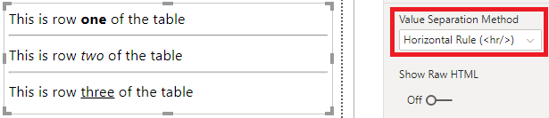
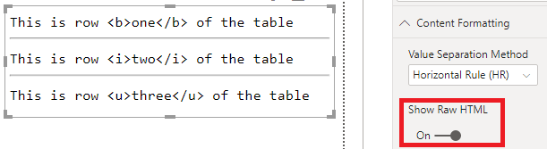
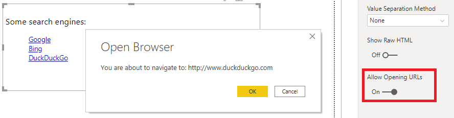

# HTML Display for Power BI

By Daniel Marsh-Patrick

 [dm-p](https://github.com/dm-p) &nbsp;&nbsp;&nbsp;&nbsp;&nbsp;  [@the_d_mp](https://twitter.com/the_d_mp) &nbsp;&nbsp;&nbsp;&nbsp;&nbsp;   [daniel-m-p](https://www.linkedin.com/in/daniel-m-p)  &nbsp;&nbsp;&nbsp;&nbsp;&nbsp; www.coacervo.co  |  [daniel@coacervo.co](mailto:daniel@coacervo.co) 

----
**Home** | [Usage](./doc/usage.md) | [Privacy Policy](./doc/privacy_policy.md)

----
## About the Visual

This custom visual is intended to be a spiritual successor to the HTML Viewer custom visual, which has recently been removed from the Power BI Marketplace.

I didn't write the original, but as there seems to be some requests out there for something similar to be available, hopefully this will fill the gap for people missing out.

The visual is currently in beta - you can download the latest version from the [Releases page](https://github.com/dm-p/powerbi-visuals-html-display/releases).

I'm intending to publish this to the Power BI Marketplace shortly, once I've done the necessary work required to list it and will update with details when available.

### Are there Still Limitations to What I Can Do with HTML in this Visual?

Yes.

A lot of the limitations that the original HTML Viewer visual had will still exist in this one; this is specifically to do with a number of restrictions imposed upon custom visual permissions by Power BI. 

For example, you can't embed content that tries to access sites with <a href ="https://en.wikipedia.org/wiki/Cross-origin_resource_sharing" target="_blank">CORS</a> configuration that will explicitly block content served from an empty domain (such as YouTube videos). Also, some stuff won't work in Desktop but will in the Service.

### So, Why Use this One?

There are some additional features that the original doesn't have:

* The previous visual was limited to columns only - if you prefer, you can use HTML generated via a measure.
* You can opt to separate data rows with a `
` (horizontal rule) element if multiple values are passed in, e.g.:
\
\

* You can opt to see the raw HTML rather than rendered HTML for debugging purposes, e.g.:
\
\

* By default, hyperlinks don't work due to custom visual limitations, but in this version you can opt to delegate URL requests to Power BI, which will provide the user with a prompt and request their approval, e.g.:
\
\

\
Please note that if in the Service, URLs will open in a new tab. This is how URLs need to work inside custom visuals.

### Is there A Privacy Policy?

[Yes](./doc/privacy_policy.md).

### Is there A Roadmap?

Not a firm one. For the moment, my intention has been to provide something to fill the current gap left by the original visual for makers and end-users.

If there is an appetite for something specific - **that can be implemented within the current custom visual security constraints**  - feel free to create an issue for it and I'll see if I can accomodate.

This visual is developed in my free time and released free of charge, so if you're grateful for my community contributions, or want dedicated or specific support, please consider a [sponsorship tier](https://github.com/sponsors/dm-p) - you'll be helping to allow me to spend more time focusing on open source development. 

Thanks for stopping by!