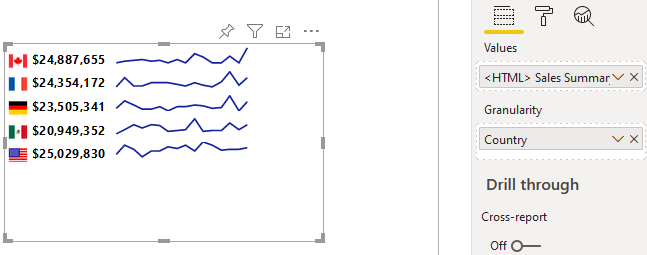
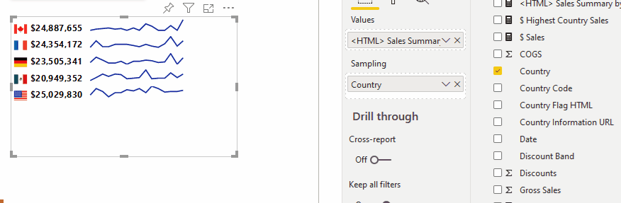
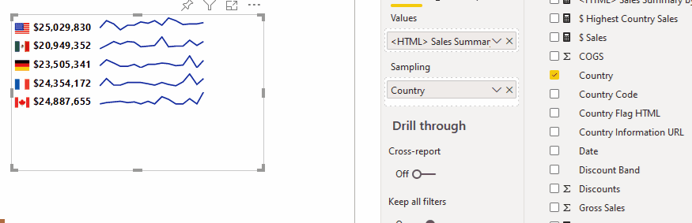
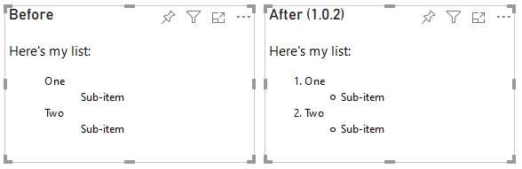

# Release Notes

---
[Home](../README.md) | **Release Notes** | [Usage](./usage.md) | [Privacy Policy](./privacy_policy.md)

---

## 1.0.2

### Minor Enhancements

#### Sorting

The visual would previously sort in the value order supplied from Power BI (typically alphabetically).

Standard sorting has been added to the visual, which is accessible from the visual header in the usual way, and will now permit you to sort by any measures or columns added to the visual's fields.

For example, if we have a visual that contains *Granularity* for **Country**, and measure that generates HTML to render the flag, total sales, and a sparkline of sales over time, there's quite a lot going on here. Power BI would sort it based on the query result, which would likely be by the *Granularity* field order (i.e. Canada first, USA last):

Now, we could specify that we sort by the **Country** in reverse order by choosing the standard sorting options in the visual header, e.g.:

But what if we want to sort by total sales? 

As there is an existing row context for **Country**, we can add our **$ Sales** measure to the *Granularity* field. This will resolve to the same value that's displayed in our HTML measure, and because it's in the visual's data we can sort by it, e.g.:

Because values in the *Granularity* field are used to generate row context for the visual and do not get rendered, you may need to consider what happens to your HTML by adding columns or measures to this field, but this should provide a pretty decent level of flexibility here.

### Bugs Fixed

#### List Items

The visual would not render ordered (`<ol/>`) or unordered (`<ul/>`) line item (`<li/>`) elements due to styling applied higher up in the custom visual host container. This has been resolved to work as expected, e.g.:

## 1.0.1

Initial version released to the Power BI Marketplace.
