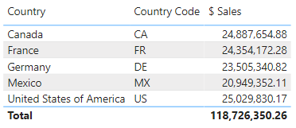
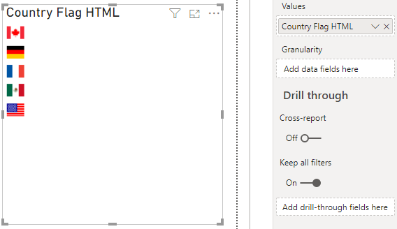
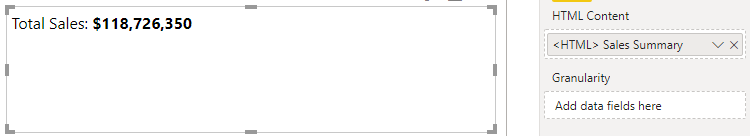
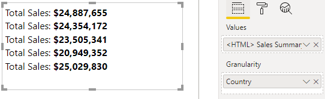
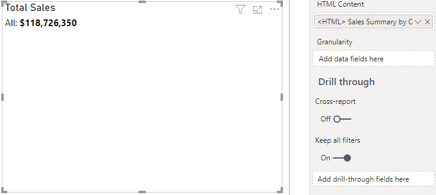
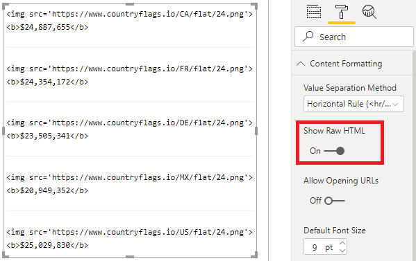
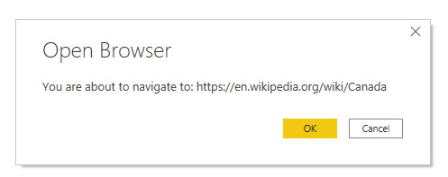
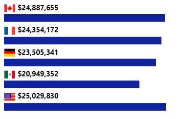
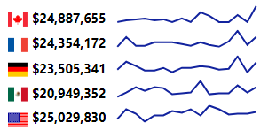

# Usage

---
[Home](../README.md) | [Release Notes](./release_notes.md) | **Usage** | [Privacy Policy](./privacy_policy.md)

---
## Getting Started

To use the visual, you need to either create a column or measure in your data model that contains valid HTML. When this is added to the **Values** data role, the visual will attempt to render the supplied HTML in the current row context.

Let's work through this with an example. Consider the following data - I'm using the [Financial Sample workbook](https://docs.microsoft.com/en-us/power-bi/create-reports/sample-financial-download) data model:



The `[Country]` and `[Country Code]` columns are fields from our data model and `[$ Sales]` is a simple `SUM()` measure that calculates total sales for the current row context.

The sample workbook is attached to each [Release](https://github.com/dm-p/powerbi-visuals-html-display/releases), if you want to download a copy.

### Columns

Let's say we want to represent the country with its flag using the [Country Flags API](https://www.countryflags.io/). We can create a calculated column as follows:

 ```
Country Flag HTML = ""
 ```
We can now add this to the HTML Content visual's **Values** data role and we'll see a flag for each value of `Financials[Country Code]`, e.g.:



> Note that while conventional HTML might use double quotes (`"`) for attribute values, these need to be escaped in DAX by using `""` for every occurrence of a double quote character. This can be tricky to keep track of in more advanced use cases.
>
> Because single quotes are valid in the W3C HTML specification, I'll be using this format going forward to keep my example DAX code a bit easier to manage. If you do want to use double quotes, the above could also be written as:
>
>`Country Flag HTML = ""`

### Measures

Now, we perhaps want to enrich this with the total sales for each country. To do this, we need the values of `[$ Sales]`

Similar to the above, we could create a measure to "narrate" this as follows:

```
<HTML> Sales Summary = "Total sales: <b>" & FORMAT([$ Sales], "$#,##0") & "</b>"
```

> Note that the measure doesn't have to have the `<HTML>` prefix. As it's good practice to try and prefix measure names  with units to denote what type of value they return, like a `$`, `#` etc. This is my preferred prefix to denote that the measure returns HTML output when inspecting it in the *Fields* list. 

Like before, we can add this to the visual's **Values** data role and this will result in the following output:



### Providing Additional Row Context

As the **Values** data role contains the HTML we want to render and our measure has no additional context, we just get the total.

If we want to split our measure for the distinct `[Country  Code]`, we can add our column to the **Granularity** data role and this will create the necessary context in the visual, e.g.:



The initial measure we built now looks a little ambiguous, so it could be changed to be context-aware if the **Granularity** data role is not present, e.g.:

```
<HTML> Sales Summary by Country = 
    VAR Sales = FORMAT([$ Sales], "$#,##0")
    VAR CountryFlag = SELECTEDVALUE(Financials[Country Flag HTML])
    VAR HasGranularity = INT(CountryFlag <> "")
    VAR Context = SWITCH(
            TRUE(),
            HasGranularity = 0, "All:", 
            CountryFlag
        )
    RETURN
        Context & " <b>" & Sales & "</b>"
```



Any value that matches the desired grain can be added - in the example above, unique values of `[Country Code]` will match the unique values of `[Country Flag]`, but we could just have easily used `[Country]` also.

You can add multiple fields to **Granularity** to produce the necessary row context if your measure requires a further level of uniqueness.

## Raw HTML

The **Show Raw HTML** property can be used to debug your generated HTML output, e.g.:



## Handling Hyperlinks to External URLs

Let's say that we want to direct our user to a page about the country when they click on the flag, and we've added a `[Country Information URL]` column to our model. In HTML, we can turn our image into a hyperlink and this is quite straightforward in DAX, e.g.:

```
<HTML> Sales Summary by Country with Hyperlink = 
    VAR Sales = FORMAT([$ Sales], "$#,##0")
    VAR CountryFlag = SELECTEDVALUE(Financials[Country Flag HTML])
    VAR CountryInformationURL = SELECTEDVALUE(Financials[Country Information URL])
    VAR HasGranularity = INT(CountryFlag <> "")
    VAR CountryContent = SWITCH(
            TRUE(),
            HasGranularity = 0, "All:", 
            CountryFlag
        )
    VAR Context = SWITCH(
            TRUE(),
            // We might have granularity, but we might not have a URL
            HasGranularity = 1 && CountryInformationURL <> "",
                "<a href='" & CountryInformationURL & "'>" & CountryContent & "</a>",
            CountryContent
        )
    RETURN
        Context & " <b>" & Sales & "</b>"
```

This will render the same output as before, and the flag is clickable, but nothing happens 😖

The reason for this is that custom visuals are protected from opening hyperlinks or external URLs on behalf of the user, as this is potentially malicious behaviour if done without any visible effect. And even though our user is clicking on a link they believe is legitimate, if phishing has taught us anything, it's certainly possible to socially engineer unsuspecting people into following malicious links.

However, custom visuals can request that Power BI open a URL on their behalf. The visual has an **Allow Opening URLs** property, which if set to **On**, will delegate the request to open the hyperlink to Power BI. If permitted, this will prompt the user for confirmation, e.g.:



While this is the raw URL, the user should still exercise caution on navigating to unknown sources.

## Further Examples with Measures and SVG

We could then, for example mix in some SVG that scales according to measures in our current context. As the measures are getting a bit larger in their scope, I've opted to break up the DAX with comments to make them a bit easier to follow.

### Simple Data Bars

This will draw a rectangle under each entry with a width proportional to percentage of the highest selling country:



```
<HTML> Sales Summary by Country - Data Bars = 
    // Define the measures we need for calculations

        // Formatted sales measure for current context
            VAR Sales = FORMAT([$ Sales], "$#,##0")

        // Summary of sales by country - makes more sense to have this as a separate measure
        // in our model, but I've added here so that the complete code is visible to the reader
            VAR SummaryByCountry = 
                    SUMMARIZE(
                        ALLSELECTED(Financials),
                        Financials[Country],
                        "Total Sales", [$ Sales]
                    )

        // Highest country sales, so that we can scale our bars, and resulting percentage
            VAR MaxSales = MAXX(SummaryByCountry, [Total Sales])
            VAR SalesBarPercent = DIVIDE(Sales, MaxSales)

        // Resolved measures, as for previous examples
            VAR CountryFlag = SELECTEDVALUE(Financials[Country Flag HTML])
            VAR CountryInformationURL = SELECTEDVALUE(Financials[Country Information URL])
            VAR HasGranularity = INT(CountryFlag <> "")
    
    // Attributes that we want to make easier to modify later
            
        // Intended width of my visual
            VAR VisualWidth = 350

        // Max width of data bars, adjusted down to provide some padding
            VAR MaxBarWidth = VisualWidth * 0.95

        // Bar attributes - we could potentially drive these through measures also
            VAR BarHeight = 16
            VAR BarColour = "#12239E"

    // Contextual country value
        VAR CountryContent = SWITCH(
                TRUE(),
                HasGranularity = 0, "All:", 
                CountryFlag
            )
    // Additional formatting of hyperlink, if we have suitable context and a URL
        VAR Context = SWITCH(
                TRUE(),
                // We might have granularity, but we might not have a URL
                HasGranularity = 1 && CountryInformationURL <> "",
                    "<a href='" & CountryInformationURL & "'>" & CountryContent & "</a>",
                CountryContent
            )
    // SVG for data bar
        VAR Bar = "<svg style='height:" & BarHeight & "px; width:" & VisualWidth & "px'>
                    <rect width='" & (MaxBarWidth * SalesBarPercent)
                        & "' height='" & BarHeight
                        & "' fill='" & BarColour & "'/>
                </svg>"
                
    RETURN
        Context & " <b>" & Sales & "</b><br/>" & Bar
```

### Sparklines

We could also take [David Eldersveld's excellent sparkline concept](https://community.powerbi.com/t5/Quick-Measures-Gallery/SVG-Sparklines-Line/td-p/486271) and apply the logic behind it to our example:



```
<HTML> Sales Summary by Country - Sparkline = 

    // Define the measures we need for calculations

        // Formatted sales measure for current context
            VAR Sales = FORMAT([$ Sales], "$#,##0")

        // Our dates
            VAR XMinDate = MIN('Financials'[Date])
            VAR XMaxDate = MAX('Financials'[Date])
            
        // Obtain overall min and overall max measure values when evaluated for each date
            VAR YMinValue = MINX(VALUES('Financials'[Date]),CALCULATE([$ Sales]))
            VAR YMaxValue = MAXX(VALUES('Financials'[Date]),CALCULATE([$ Sales]))

        // Resolved measures, as for previous examples
            VAR CountryFlag = SELECTEDVALUE(Financials[Country Flag HTML])
            VAR CountryInformationURL = SELECTEDVALUE(Financials[Country Information URL])
            VAR HasGranularity = INT(CountryFlag <> "")
    
    // Attributes that we want to make easier to modify later
            
        // Intended width of my visual
            VAR VisualWidth = 350

        // Intended dimensions of SVG view box
            VAR ViewboxWidth = VisualWidth * 0.5
            VAR ViewboxHeight = 20
            VAR SparklineScaleFactor = 0.9

        // Sparkline attributes - we could potentially drive these through measures also
            VAR SparklineHeight = ViewboxHeight * SparklineScaleFactor
            VAR SparklineWidth = ViewboxWidth * SparklineScaleFactor
            VAR SparklineStrokeWidth = 2
            VAR SparklineColour = "#12239E"
            
    // Sparkline calculations WRT attributes

        // Build table of X & Y coordinates and fit to viewbox
            VAR SparklineTable = ADDCOLUMNS(
                SUMMARIZE(
                    'Financials',
                    'Financials'[Date]
                ),
                "X", INT(SparklineWidth * DIVIDE('Financials'[Date] - XMinDate, XMaxDate - XMinDate)),
                "Y", INT(SparklineHeight * DIVIDE([$ Sales] - YMinValue,YMaxValue - YMinValue))
            )

        // Concatenate X & Y coordinates to build the sparkline
            VAR Lines = CONCATENATEX(SparklineTable, [X] & "," & SparklineHeight - [Y], " ", [Date])

    // Contextual country value
        VAR CountryContent = SWITCH(
                TRUE(),
                HasGranularity = 0, "All:", 
                CountryFlag
            )
    // Additional formatting of hyperlink, if we have suitable context and a URL
        VAR Context = SWITCH(
                TRUE(),
                // We might have granularity, but we might not have a URL
                HasGranularity = 1 && CountryInformationURL <> "",
                    "<a href='" & CountryInformationURL & "'>" & CountryContent & "</a>",
                CountryContent
            )
    // SVG for sparkline
        VAR Sparkline = "<svg style='height:" & ViewboxHeight & "px; width:" & ViewboxWidth & "px'>
                    <g transform='translate(" 
                            // Adjust X/Y for padding
                                & DIVIDE(ViewboxWidth - SparklineWidth, 2) & ", " 
                                & DIVIDE(ViewboxHeight - SparklineHeight, 2) & ")'>
                        <polyline fill='none' stroke='" 
                            & SparklineColour & "' stroke-width='"
                            & SparklineStrokeWidth & "' points='" 
                            & Lines 
                            & "'/>
                    </g>
                </svg>"
                
    RETURN
        Context & " <b>" & Sales & "</b> " & Sparkline & "<br/>"
```

As you can see, we can start to construct some very rich output based on our data 😀
